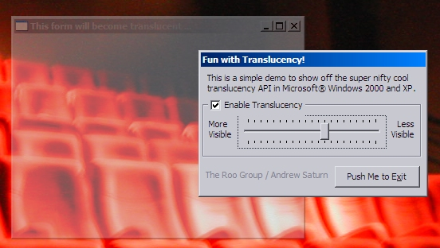



## Form Translucency API example \(WinXP/2k only\)

### Description

This code makes the form appear "translucent", or semi-transparent, using Windows API. This isn't one of the ones which requires a ton of DLL's, however it'll only work on Windows XP or 2K (the only systems that have the API required to do this).
 
### More Info
 
This *WILL NOT* work on Windows 95, NT, 98, ME, or any other versions other than Windows 2000 -or- Windows XP. Versions that come out after XP probably will allow this to work, but nothing earlier. Don't say I should write something to allow it to work on 9x please. I know that would be cool, but it isn't very practical (just get 2k or XP if you want this that bad... honestly). There are other examples on PSC that can do it for 9x, and you will see they are very slow and don't auto-update, because they aren't truly translucent... they're just made to appear that way.

             |
---                |---
**Submitted On**   |2003-04-15 04:13:00
**By**             |[Andrew Saturn](https://github.com/Planet-Source-Code/PSCIndex/blob/master/ByAuthor/andrew-saturn.md)
**Level**          |Beginner
**User Rating**    |4.8 (24 globes from 5 users)
**Compatibility**  |VB 6\.0
**Category**       |[Windows API Call/ Explanation](https://github.com/Planet-Source-Code/PSCIndex/blob/master/ByCategory/windows-api-call-explanation__1-39.md)
**World**          |[Visual Basic](https://github.com/Planet-Source-Code/PSCIndex/blob/master/ByWorld/visual-basic.md)
**Archive File**   |[Form\_Trans1573924152003\.zip](https://github.com/Planet-Source-Code/andrew-saturn-form-translucency-api-example-winxp-2k-only__1-44695/archive/master.zip)

